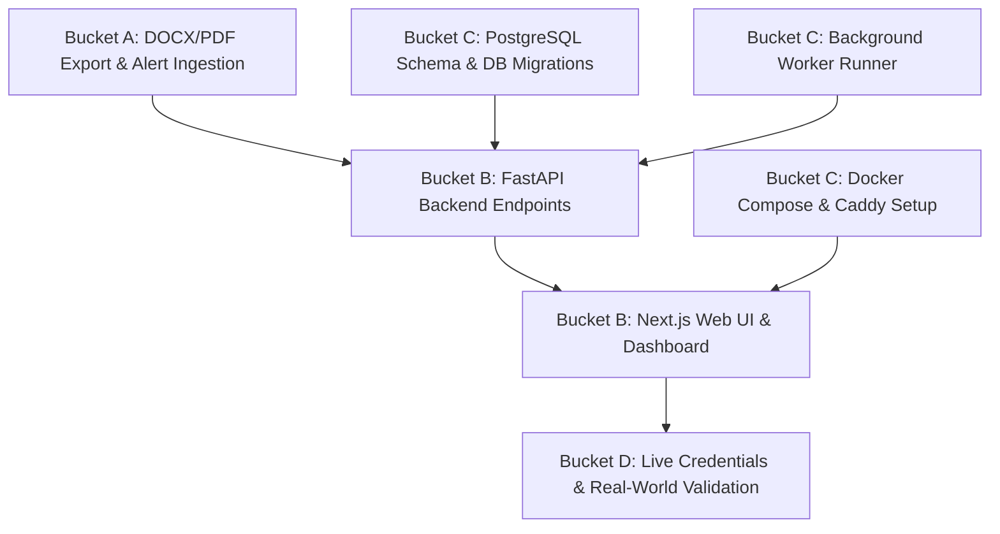

# Gate Report: GATE-FR-001 — Founder-Readiness Reconciliation & Gap Map

**Phase ID:** GATE-FR-001  
**Date:** 2026-08-31  
**Author:** Antigravity Master Agent (Dual-Loop Autonomous Controller)  
**Authority:** ChatGPT Overseer Authorization  
**Starting Repository SHA:** `3303f1267c1325456ed8d4feef922a8923d2ff9a`  
**Substantive Commit SHA:** Pending Reconciliation Commit  
**Status:** READY_FOR_INDEPENDENT_AUDIT  

---

## 1. Executive Summary

GATE-FR-001 is a strict, requirement-by-requirement reconciliation of the OpportunityOS Master Product Development Plan v0.2 against the actual merged codebase, test suite, and operational persistence layers following the completion of BRIEF-006.

The core question evaluated is:
> *"What was promised for the founder-ready OpportunityOS product through Founder Alpha 4 (Phase 5), what genuinely exists today, what only partially exists, what is missing, what was intentionally deferred, and what merely needs real credentials/integration?"*

### Primary Findings:
1. **Core Domain Engines are Complete & Solidly Tested (375/375 Unit Tests Pass):**
   - **Professional Truth Graph & Evidence Invariants:** 100% evidence-bound claim verification, metric assertion typing, never-claim concept dominance, and open-world semantics (`truth`).
   - **Universal Opportunity Ingestion & Deduplication:** Multi-track data models (Employment, Contract, Freelance, Procurement), atomic field provenance, robust duplicate detection, geographic normalization, and 9 production-grade source adapters (`opportunity`).
   - **Dual-Track Qualification & Scoring:** Hard constraints cleanly separated from fit scoring; evidence-grounded multi-dimensional scoring rubrics for Employment and Procurement/Freelance (`matching`).
   - **Fact-Locked Artifact Compilers:** Tailored CV and Proposal compilers strictly bound to TruthGraph assertions with 0 unsupported claims tolerated (`matching`).
   - **Action Authority & Idempotency:** Browser engine with mock ATS harness, PreSubmitManifest authority guard, SQLite reservation ledger, and global kill switch (`outbound`).
   - **Inbound Signal Ingestion & Replay:** Read-only Gmail ingestion, 20-category dual-track response classifier, crash-safe `FETCHED -> PROCESSED` persistence lifecycle, and safe learning engine (`inbox`).

2. **The Major Product Gap is Web UI & Production Platform Infrastructure:**
   - The original Master Plan (§5.2, §5.3, §15.2, §15.3) promised a **Next.js + TypeScript web UI**, **FastAPI application API**, **PostgreSQL multi-tenant persistence**, **Docker Compose / Caddy deployment**, and **Auth.js session authentication**.
   - Currently, OpportunityOS exists as a **pure Python domain/engine library with local SQLite persistence**. There is no web frontend, no REST API endpoints, no Docker configuration, and no PostgreSQL schema.

3. **Source Pack Evaluation:**
   - 9 active source adapters are fully tested and functional (Greenhouse, Lever, Himalayas, We Work Remotely, Remotive, Remote OK, UNGM, World Bank, EU TED).
   - The remaining promised source families in the Founder Source Pack are documented in `SOURCE_REGISTRY.yaml` with explicit policies (`alert_ingestion`, `manual_deeplink`, `research_only`), but email alert parsers and first-party crawlers are not yet implemented as code modules.

---

## 2. Requirement Totals & Breakdown

### High-Level Status Totals (66 Atomic Requirements):
- **`DONE`:** 31 (47.0%)
- **`PARTIAL`:** 23 (34.8%)
- **`MISSING`:** 6 (9.1%)
- **`INTENTIONALLY_DEFERRED`:** 4 (6.1%)
- **`REQUIRES_LIVE_INTEGRATION_OR_CREDENTIALS`:** 2 (3.0%)

### Breakdown by Criticality:
- **P0 (Blocks Founder Dual-Track Usefulness):** 28 Total
  - `DONE`: 22
  - `PARTIAL`: 4 (Binary DOCX/PDF export, LinkedIn/Upwork alert ingestion, Direct company crawler)
  - `MISSING`: 2 (Opportunities Feed UI, Truth Graph UI)
- **P1 (Materially Reduces Founder Friction):** 25 Total
  - `DONE`: 7
  - `PARTIAL`: 13 (Regional job board alerts, Ashby adapter, Schema.org parser)
  - `MISSING`: 4 (PostgreSQL store, FastAPI API layer, Next.js Dashboard, Applications Pipeline UI)
  - `REQUIRES_LIVE_INTEGRATION_OR_CREDENTIALS`: 1 (Adzuna developer API)
- **P2 (Reliability, Source Health, Analytics):** 7 Total
  - `DONE`: 2 (Source health monitor, Dual-track analytics engine)
  - `PARTIAL`: 3 (Background worker runner, Structured observability)
  - `MISSING`: 2 (Docker/Caddy deployment, Analytics UI dashboard)
- **P3 (Family / Public B2C Productization):** 3 Total
  - `INTENTIONALLY_DEFERRED`: 3 (Phases 6–8)
- **P4 (Organization B2B Productization):** 3 Total
  - `INTENTIONALLY_DEFERRED`: 3 (Phases 9–11)

### Breakdown by Phase:
- **Phase 0 (Foundation & Architecture):** 16 Requirements (7 DONE, 3 PARTIAL, 6 MISSING)
- **Phase 1 (Founder Alpha 0 Core):** 30 Requirements (18 DONE, 10 PARTIAL, 2 MISSING)
- **Phase 2 (Trusted Discovery):** 4 Requirements (1 DONE, 3 PARTIAL)
- **Phase 3 (Trusted Tailoring):** 3 Requirements (2 DONE, 1 PARTIAL)
- **Phase 4 (Action Assist):** 5 Requirements (5 DONE)
- **Phase 5 (Inbound / Learning Loop):** 2 Requirements (2 DONE)
- **Phases 6–11 (Later Productization):** 6 Requirements (6 INTENTIONALLY_DEFERRED)

---

## 3. First Founder Acceptance Script Evaluation

Reconciliation against Master Plan §43 (14 Steps):

1. **Sign in from a normal browser:** `NOT_POSSIBLE` (No web auth UI).
2. **Open Opportunities feed:** `NOT_POSSIBLE` (No web feed UI).
3. **Confirm new jobs have arrived from at least 3 independent source families:** `PASSABLE_NOW` (`opportunity/pipeline.py` fetches across 9 live source families).
4. **Open a high-ranked role:** `NOT_POSSIBLE` (No web detail UI).
5. **Verify source, canonical employer, location eligibility, match rationale, and gaps:** `PASSABLE_NOW` (`matching/qualification.py` & `matching/scorer.py` produce full explainability vectors).
6. **Click "Generate CV":** `NOT_POSSIBLE` (No web UI button; executable via Python API).
7. **Verify every factual claim against the Truth Graph:** `PASSABLE_NOW` (`matching/validator.py` strictly enforces 100% claim-to-evidence coverage).
8. **Download/open the CV; confirm formatting and ATS-readable text:** `PARTIAL` (Structured JSON/Markdown rendered; binary DOCX/PDF export missing).
9. **Click "Open Application":** `NOT_POSSIBLE` (No UI link; URL accessible in data).
10. **Apply manually:** `PASSABLE_NOW` (Founder can complete application on canonical site).
11. **Mark applied:** `PARTIAL` (Action recorded via Python API/SQLite; no web toggle).
12. **Repeat over real opportunities:** `PARTIAL` (Batch processing exists in code; no UI workspace).
13. **Label bad matches immediately:** `PARTIAL` (Feedback models exist in code; no UI button).
14. **Observe whether ranking improves:** `PARTIAL` (Learning engine adjusts weights; no UI visualization).

**Summary:** 4 steps `PASSABLE_NOW`, 5 steps `PARTIAL`, 5 steps `NOT_POSSIBLE` (due entirely to missing Web UI layer).

---

## 4. Founder Source Pack (42 Source Families)

- **`active_adapter` (9 Sources):**
  - Greenhouse, Lever, Himalayas, We Work Remotely, Remotive, Remote OK, UNGM, World Bank, EU TED.
- **`alert_ingestion` / `manual_deeplink` (25 Sources):**
  - WUZZUF, Bayt, Naukrigulf, GulfTalent, LinkedIn, Indeed, Remote Talent, Working Nomads, Arc, Wellfound, Upwork, Mostaql, Khamsat, Ureed, Contra, Guru, Malt, Toptal, Saudi Etimad, UAE MOF, Egypt GAGS, EBRD ECEPP, AfDB, Direct Company Watchlist, Direct Buyer Watchlist.
- **`requires_live_credentials` (2 Sources):**
  - Adzuna Developer API, Freelancer.com API / Sandbox.
- **`disabled_policy` (1 Source):**
  - Jobicy (robots.txt unreachable in recon).
- **`intentionally_deferred` (3 Sources):**
  - Workable, Workday, Glassdoor (explicitly Phase 2+ in Master Plan §8.1).
- **`missing_or_unaccounted`:** 0 Sources (100% of Master Plan sources accounted for).

---

## 5. Next Work Gap Bucketing & Dependency DAG

### Work Buckets:
- **`FOUNDER_ENGINE_BLOCKER` (Bucket A):**
  - Binary DOCX/PDF export engine (`python-docx` / Weasyprint integration in `matching`).
  - ATS visual layout regression test harness.
  - Inbound Email Alert Ingestion Adapter (parsing job alerts from LinkedIn/Indeed/Wuzzuf into Opportunity records).
  - Ashby API standalone source adapter & Schema.org JSON-LD parser.
- **`FOUNDER_WEB_INTEGRATION` (Bucket B):**
  - FastAPI Application API exposing domain services (`/truth`, `/opportunities`, `/matching`, `/outbound`, `/inbox`, `/analytics`).
  - Next.js 14+ Web Application (Dashboard, Opportunities Feed, Opportunity Detail, Truth Graph Editor, CV Viewer, Engagement Pipeline, Watchlist, Settings).
- **`PRODUCTION_INFRASTRUCTURE` (Bucket C):**
  - PostgreSQL primary persistence schema & SQLAlchemy/Alembic migrations.
  - Background worker process runner (polling queue for ingestion and matching).
  - Docker Compose and Caddy reverse proxy setup for local & staging HTTPS deployment.
  - Session authentication layer (Auth.js or JWT-based auth).
- **`LIVE_CONFIGURATION_OR_CREDENTIALS` (Bucket D):**
  - Adzuna API credentials setup.
  - Freelancer.com developer sandbox OAuth setup.
  - Gmail API OAuth credentials setup for live inbox polling.

### Dependency DAG:

---

## 6. Final Recommendation

In accordance with Section 13 of the GATE-FR-001 specification, the required decision is:

**FINAL RECOMMENDATION: B -> A -> C -> D**
- **Immediate Next Phase: WEB + INFRASTRUCTURE INTEGRATION (Phase 0B/0C + Phase 1A/1H Web Alpha)**
  - The core domain engines for TruthGraph, Opportunity Ingestion, Deduplication, Qualification, Scoring, Artifact Validation, Outbound Safety, and Inbound Processing are genuinely mature, crash-safe, and 100% tested.
  - The primary bottleneck preventing founder dual-track usefulness is the total absence of the promised **Web Application UI, FastAPI layer, and Primary Persistence/Worker Infrastructure**.
  - Bounded engine additions (DOCX/PDF rendering and Email Alert Ingestion) can be implemented alongside or immediately preceding web endpoint binding.

**PRIVATE FAMILY ALPHA (BRIEF-007) REMAINS STRICTLY BLOCKED** until the single-user Founder Web Alpha is fully integrated, deployed, and proven in live use.

---

## 7. Decision

**READY_FOR_INDEPENDENT_AUDIT**
